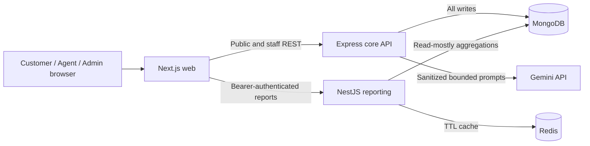

# ADR 001: Pente Support Platform Architecture

- **Status:** Accepted
- **Date:** 2026-08-26
- **Decision owners:** Full-stack engineering
- **Detailed reference:** [Pente Support Platform - Detailed Architecture](architecture.md)

## Context

The product must support two journeys: public customers create, find, view, and reply to tickets; authenticated Agents and Admins manage assignment, status, SLA, conversations, audit history, AI summaries, and AI triage. The required stack includes Next.js, an Express API, MongoDB, a separate NestJS reporting service, Gemini integration, caching, tests, Docker, and CI.

The design must prioritize server-enforced role separation, safe AI failure, clear service ownership, reproducible delivery, and enough operational maturity to explain how the system would evolve beyond a take-home implementation.

## Decision drivers

1. Customer, Agent, and Admin permissions must remain distinct and must not depend on hidden UI controls.
2. Ticket writes and business invariants need one authoritative owner.
3. Gemini must be server-only, bounded by timeout/rate limits, and unable to block core ticket work.
4. Reporting must be independently deployable and read-mostly.
5. Shared contracts should remain consistent without duplicating enums, validation, SLA, or transition rules.
6. Local development and CI must exercise production-like service boundaries without unnecessary infrastructure.

## Decision

Use a pnpm TypeScript monorepo with four explicit boundaries:

| Component            | Responsibility                                                                                 |
| -------------------- | ---------------------------------------------------------------------------------------------- |
| `apps/web`           | Next.js public portal and role-aware staff workspace                                           |
| `apps/api`           | Express write service for authentication, tickets, SLA, audit, authorization, and AI mediation |
| `services/reporting` | NestJS read-mostly aggregation API with Swagger and caching                                    |
| `packages/shared`    | Shared enums, Zod schemas, SLA constants, state transitions, and transport types               |

The runtime shape is:

The Express API is the only application writer to MongoDB. Reporting reads the same ticket collection to meet the brief, but it cannot mutate tickets. Redis contains disposable derived report data; MongoDB remains the system of record. Gemini is outside the platform trust boundary and receives only sanitized, bounded text.

Within the core API, dependencies flow `route -> validation/auth middleware -> controller -> service -> model`. Routes declare HTTP and permission boundaries, controllers translate transport data, services enforce domain rules, and Mongoose models define persistence. React pages do not own authorization, SLA, or transition logic.

## Authentication and authorization

Customers do not have accounts because the specified public journey uses email-only lookup. Details and reply requests carry normalized email in the request body. The API compares it with the stored ticket owner before accepting or returning data, returns the same not-found response for a mismatch, rate-limits lookup, and exposes only a customer-safe projection. Assignment, audit history, customer email, staff roles, and AI-review metadata never appear in public responses. This is a documented take-home compromise; production should use email OTP or magic links.

Agents and Admins authenticate with email/password. The API returns a signed 15-minute access token and a signed seven-day refresh token containing a random nonce, delivered in an HttpOnly, SameSite cookie. Only a SHA-256 refresh-token hash is stored. Refresh rotates the token; reuse of a revoked token invalidates its family. Logout revokes the presented token.

Every staff route verifies token signature, expiry, type, and role. Agents may work on their own or unassigned tickets and take an unassigned ticket for themselves. Admins additionally reassign, directly change priority, delete tickets, and access SLA-breach details. Service methods enforce assignment/resource rules after middleware establishes the broad role boundary.

## Data, state, and SLA

Tickets embed conversations, audit events, and an optional AI recommendation because those records are read with the ticket and are acceptably bounded for this scope. Separate collections store staff users, hashed refresh sessions, and the atomic ticket-number counter. Indexes cover ticket number, customer email, assignment, SLA deadline, list filters, and search.

The shared package defines the only permitted state transitions: Open to In Progress/Closed; In Progress to Waiting for Customer/Resolved/Closed; Waiting for Customer to In Progress/Resolved; Resolved to Closed/In Progress; and none from Closed. The API rejects everything else. Customer replies reopen Waiting for Customer to In Progress; Closed tickets reject replies.

SLA deadlines are derived from creation time: Critical 4 hours, High 8 hours, Medium 24 hours, and Low 48 hours. Priority changes recalculate from the original creation timestamp. Breach status is derived from current time and non-terminal status instead of trusting a stale persisted flag.

## AI integration and graceful degradation

The API depends on an `AiProvider` interface with Gemini, deterministic mock, and disabled adapters. The Gemini adapter strips HTML, redacts credential/card/secret-like values, bounds message count and size, requests structured output, validates responses, applies an eight-second timeout, and maps throttling, invalid output, network failure, and timeout to a safe `AI_UNAVAILABLE` response. AI routes use a stricter rate limit and the provider key never reaches the browser.

Ticket creation commits before automatic triage begins, so AI cannot prevent ticket creation. Triage remains `Pending Review` and cannot change priority without staff confirmation. Summarization is explicit, stored as AI-generated content, and replaces the previous generated summary. When AI fails, all ticket reads, replies, assignment, status, priority, and reporting remain available.

## Reporting and caching

The NestJS service validates the same access-token format and exposes overview, agent performance, SLA attention, trends, webhook preview, Swagger, and health endpoints. Redis caches overview for 60 seconds, agents for 120 seconds, and trends for 300 seconds per range. SLA attention remains uncached because its state changes with wall-clock time.

If Redis is unavailable, the service falls back to an in-process TTL cache and reports the active backend. This chooses availability with bounded staleness; a future event-driven design can provide stronger freshness.

## Consequences and accepted trade-offs

- **Monorepo:** simplifies shared contracts and CI, but deployables share one lockfile and require disciplined package boundaries.
- **Shared MongoDB:** meets the brief and avoids synchronization, but reporting schema changes must coordinate with the write service. At scale, use a read replica or materialized reporting store.
- **In-process AI triage:** minimizes scope and never blocks ticket creation, but an unfinished job can be lost on process termination. Production needs a durable idempotent queue with retry budgets and dead-letter handling.
- **TTL cache:** keeps design simple and resilient, but accepts bounded stale reports. Domain-event invalidation is the next step when freshness requires it.
- **Session-storage access token:** works with the split API architecture, but a same-origin backend-for-frontend would better protect browser sessions.
- **Hard deletion:** matches the Admin requirement, but production compliance may require soft deletion and an immutable audit store.
- **No MongoDB transactions:** supports a single-node assessment environment. Replica-set transactions should be added when cross-document invariants require them.

Alternatives rejected for this scope include separate service databases, a message broker, customer account management, event-driven cache invalidation, and a backend-for-frontend. Each adds valid production capability but would increase operational surface without improving the assessment's core workflows enough to justify it.

## Delivery and verification

Each deployable has a multi-stage Dockerfile. Docker Compose starts MongoDB, Redis, API, reporting, and web with dependency health checks. GitHub Actions performs frozen installation, formatting, linting, production dependency audit, builds, isolated tests, Playwright lifecycle E2E, and all three image builds. No paid AI service is called in CI.

The detailed component ownership, trust boundaries, runtime flows, failure matrix, deployment topology, and requirement traceability are documented in [docs/architecture.md](architecture.md).
