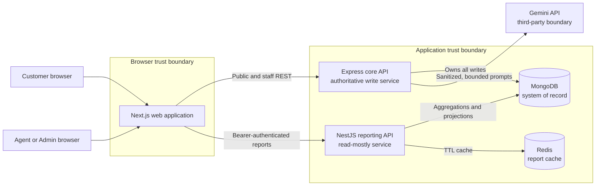
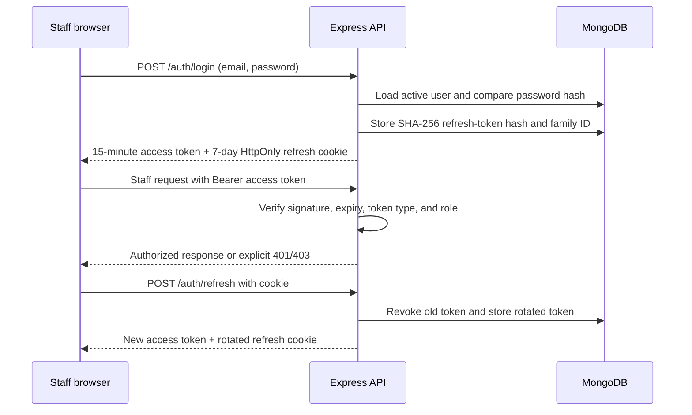

# Pente Support Platform - Detailed Architecture

- **Companion decision record:** [ADR 001](adr.md)
- **Last reviewed:** 2026-08-26
- **Scope:** Web application, core API, reporting service, data stores, AI integration, security boundaries, runtime flows, and deployment model

## 1. Context and decision drivers

Pente Support is a two-sided support-ticket product. Customers create, find, view, and reply to tickets through a public journey. Agents and Admins use an authenticated workspace to assign tickets, communicate with customers, enforce ticket-state rules, monitor SLAs, review audit history, and use AI-assisted summarization and triage. A separate reporting service provides operational aggregates without owning transactional writes.

The architecture is driven by these requirements:

1. Keep Customer, Agent, and Admin permissions distinct and enforce them on the server.
2. Keep ticket writes and business invariants in one authoritative service.
3. Call Gemini only from the server, bound cost and latency, and keep ticket work available when AI fails.
4. Isolate reporting so it can scale independently without becoming a second writer.
5. Support reproducible local development and production-like packaging with one repository.
6. Make validation, failure behavior, auditability, testing, and operability first-class concerns.
7. Prefer a small, defensible architecture over speculative infrastructure that is not justified by the take-home scope.

## 2. Decision summary

| Concern           | Decision                                                        | Reason                                                                                     |
| ----------------- | --------------------------------------------------------------- | ------------------------------------------------------------------------------------------ |
| Repository        | pnpm TypeScript monorepo                                        | One lockfile and shared contracts while keeping deployable boundaries explicit             |
| User interface    | Next.js App Router                                              | Separate public and staff journeys with reusable React components and production builds    |
| Transactional API | Express + Mongoose                                              | A focused write owner for authentication, tickets, SLA, audit, and AI orchestration        |
| Reporting         | Independent NestJS service                                      | Demonstrates service separation, aggregation, validation, Swagger, and independent scaling |
| Primary data      | Shared MongoDB                                                  | Matches the required stack; Express owns writes and reporting is read-mostly               |
| Report cache      | Redis with in-memory TTL fallback                               | Shared cache in normal operation without making Redis a reporting availability dependency  |
| Authentication    | Short-lived JWT access token + rotating signed refresh token    | Stateless API authorization with revocable, reuse-detecting sessions                       |
| AI boundary       | `AiProvider` interface with Gemini, mock, and disabled adapters | Provider isolation, deterministic tests, and explicit degradation                          |
| Deployment        | Three multi-stage images orchestrated by Docker Compose         | Independently buildable services and one-command local startup                             |

## 3. System context and trust boundaries



The browser is not a security boundary. Hiding an Admin control improves usability, but every privileged operation is independently authenticated and authorized by the receiving API. MongoDB is the system of record. Redis is disposable derived state. Gemini is outside the platform trust boundary and receives only bounded, sanitized ticket text.

## 4. Repository and component boundaries

```text
apps/
  web/                  Next.js public portal and staff workspace
  api/                  Express transactional API and Gemini adapter
services/
  reporting/            NestJS reporting and analytics service
packages/
  shared/               Enums, Zod schemas, SLA rules, transitions, transport types
docs/                   ADR, endpoint reference, examples, and screenshots
k8s/                    Optional API deployment example
docker-compose.yml      Local platform orchestration
```

| Component            | Owns                                                                                                                                   | Must not own                                                        |
| -------------------- | -------------------------------------------------------------------------------------------------------------------------------------- | ------------------------------------------------------------------- |
| `apps/web`           | Pages, form state, loading/error/empty states, role-aware navigation, API clients                                                      | Authorization decisions, secrets, SLA rules, direct database access |
| `apps/api`           | Authentication, authorization, ticket writes, status transitions, SLA calculation, audit events, public response shaping, AI mediation | Reporting UI or direct browser storage policy                       |
| `services/reporting` | Read-only/read-mostly aggregations, report authorization, caching, Swagger, reporting health                                           | Ticket mutations, refresh sessions, AI calls                        |
| `packages/shared`    | Stable cross-service enums, schemas, transport types, SLA constants, transition rules                                                  | Runtime infrastructure or service-specific persistence code         |

The API follows `route -> validation/auth middleware -> controller -> service -> model`. Routes declare HTTP and permission boundaries, controllers translate transport data, services enforce business rules, and Mongoose models define persistence. This prevents controllers or React pages from becoming alternate locations for domain rules.

## 5. Runtime request flows

### 5.1 Public customer flow

1. The browser submits a validated ticket request to `POST /api/v1/public/tickets`.
2. The core API sanitizes text, allocates the next `TKT-####` number through an atomic counter, sets Medium priority, derives `slaDueAt`, writes the initial conversation and audit event, and returns a customer-safe projection.
3. AI triage starts only after the ticket has been persisted. AI failure cannot roll back ticket creation.
4. Lookup, details, and reply requests send the normalized customer email in a request body, never in a URL.
5. The API compares that email with the stored owner before returning data or accepting a reply. A mismatch returns the same not-found response as an unknown ticket.
6. Public projections omit `customerEmail`, `assignedTo`, `auditLog`, staff roles, and AI-review metadata.

Email-only ownership is an explicit assessment constraint and not strong authentication. Lookup is rate-limited to reduce enumeration. A production portal would replace it with a short-lived email OTP or magic link.

### 5.2 Staff authentication and authorization



Access tokens contain the user ID, email, name, role, and token type. The browser keeps the short-lived access token in session storage; the refresh token is inaccessible to JavaScript through an HttpOnly, SameSite cookie. Only token hashes are persisted. Reuse of a revoked refresh token revokes the entire token family.

Agents may read tickets assigned to them or unassigned tickets, take an unassigned ticket for themselves, reply, make valid status changes, and review AI output. Admins additionally reassign tickets, directly change priority, delete tickets, and access the SLA-breach report. Express middleware establishes the coarse Agent/Admin boundary; service methods enforce resource-specific rules such as ticket ownership and assignment.

### 5.3 Ticket state and SLA invariants

The shared package defines the only allowed state machine:

| From                 | Allowed destinations                   |
| -------------------- | -------------------------------------- |
| Open                 | In Progress, Closed                    |
| In Progress          | Waiting for Customer, Resolved, Closed |
| Waiting for Customer | In Progress, Resolved                  |
| Resolved             | Closed, In Progress                    |
| Closed               | None                                   |

The API rejects every transition not listed above. Agents must first own a ticket before changing status or replying. A customer reply moves `Waiting for Customer` back to `In Progress`; Closed tickets reject replies.

SLA deadlines are derived from creation time: Critical 4 hours, High 8 hours, Medium 24 hours, and Low 48 hours. Changing priority recalculates the deadline from the original creation time. Breach state is computed from the current time and terminal status rather than trusted as a stale persisted boolean. The core dashboard and reporting aggregations apply the same rule.

### 5.4 AI summarization and triage

The core API owns the AI boundary. The browser never receives the provider key and never calls Gemini directly. The adapter:

- removes HTML and redacts credential-, secret-, and payment-card-like values;
- limits the number and size of messages;
- uses a low-variance, structured prompt and validates the response shape;
- aborts after the configured timeout;
- maps provider throttling, invalid output, network failure, and timeout to a safe `AI_UNAVAILABLE` contract;
- applies a stricter rate limiter to AI routes.

Summarization is a staff action and replaces the previous generated summary, avoiding duplicate AI conversation entries. Triage produces a priority/category recommendation with a confidence and explanation, but stores it as `Pending Review`. It cannot change priority until an Agent or Admin confirms it. The mock adapter is deterministic for tests, while production configuration rejects the mock provider.

### 5.5 Reporting flow

The reporting service verifies the same signed access-token format as the core API. It exposes overview, per-agent metrics, SLA attention, trends, webhook preview, Swagger, and health endpoints. The Admin role is required for SLA-breach details.

MongoDB aggregations are cached as follows:

| Report        | Cache policy                 | Reason                                                 |
| ------------- | ---------------------------- | ------------------------------------------------------ |
| Overview      | 60-second TTL                | Frequently requested collection-wide grouping          |
| Agents        | 120-second TTL               | More expensive assignment and resolution-time grouping |
| Trends        | 300-second TTL per day range | Historical buckets change less frequently              |
| SLA attention | Not cached                   | Deadline state changes with wall-clock time            |

Redis provides a shared cache across instances. If it is absent or fails during a request, the service falls back to an in-process TTL map and exposes the active backend through health/report metadata. Cache failure therefore affects performance and cross-instance consistency, not report availability.

## 6. Data model and ownership

MongoDB contains four logical records:

- **Ticket:** customer request, priority, status, SLA deadline, assignment, resolution timestamp, conversations, audit events, and optional AI recommendation.
- **User:** active Agent/Admin identity and password hash.
- **Refresh token:** user reference, token hash, family, expiry, revocation, and replacement link.
- **Counter:** atomic ticket-number sequence.

Conversations and audit events are embedded because they are read with the ticket and are bounded adequately for the assessment. Indexes support ticket number, customer email, assignment, SLA deadline, status/priority lists, and text search. The Express API is the only writer. Reporting shares the database to meet the brief but treats the ticket collection as read-mostly.

## 7. Failure handling and operability

| Failure                           | User-visible behavior                                               | Operator signal                                                         |
| --------------------------------- | ------------------------------------------------------------------- | ----------------------------------------------------------------------- |
| MongoDB unavailable               | Readiness returns 503; data operations return a safe server error   | Structured error log and database readiness state                       |
| Gemini disabled/unavailable/slow  | Ticket work continues; staff see a retryable AI-unavailable message | Error code, request ID, and provider failure log without ticket content |
| Redis unavailable                 | Reports continue using memory cache                                 | Readiness/report metadata identifies memory backend                     |
| Invalid or expired access token   | One refresh attempt, then session-expired flow                      | Clear 401 without token contents                                        |
| Insufficient role/resource access | Action denied without relying on UI hiding                          | Clear 403 and request completion log                                    |
| Invalid input or state transition | Field-level 400 or explicit transition error                        | Stable error code and request ID                                        |

Both APIs expose liveness and dependency-aware readiness endpoints. The core API also exposes basic process metrics. Helmet, explicit CORS origin, a 64 KB JSON body limit, centralized validation/error handling, and structured request-completion logging provide baseline production safeguards. Logs exclude authorization headers, cookies, passwords, sensitive ticket bodies, and stack traces from client responses.

## 8. Deployment and delivery architecture

Each deployable has a multi-stage Dockerfile. Docker Compose starts MongoDB, Redis, the core API, reporting, and the web application with health-based dependencies. The web image contains a standalone Next.js build; API and reporting images contain compiled production output.

GitHub Actions runs on pull requests and pushes to `main`: frozen dependency installation, formatting, linting, production dependency audit, builds, isolated unit/integration tests, Playwright lifecycle E2E, and all three Docker image builds. No paid AI API is called in CI. The Kubernetes files demonstrate how the core API can be externalized through a Deployment, Service, ConfigMap, and Secret without coupling that deployment choice to application code.

## 9. Alternatives considered and consequences

| Alternative                              | Why it was not selected now                                             | When to reconsider                                                            |
| ---------------------------------------- | ----------------------------------------------------------------------- | ----------------------------------------------------------------------------- |
| Separate databases per service           | Adds synchronization and operational complexity beyond the brief        | Reporting load or isolation requirements justify a replica/materialized store |
| Durable AI queue                         | Correct production direction, but adds broker and worker scope          | AI reliability, retries, or throughput become product requirements            |
| Customer account system                  | Conflicts with the required email-only journey                          | Before handling real customer data                                            |
| Store all tokens in HttpOnly cookies/BFF | Stronger browser security but requires same-origin proxy/session design | First production security iteration                                           |
| Event-driven cache invalidation          | Fresher data but needs domain events and delivery guarantees            | Report freshness can no longer tolerate short TTLs                            |
| MongoDB transactions                     | Take-home may run a single-node instance                                | Replica-set deployment and cross-document invariants require them             |
| Soft deletion and immutable audit store  | More compliant but exceeds the requested Admin hard-delete behavior     | Retention, legal, or compliance policy is defined                             |

Consequences of the selected architecture are deliberate: the monorepo improves consistency but couples releases through one lockfile; a shared MongoDB simplifies delivery but creates schema coordination; TTL caching trades bounded staleness for availability; in-process AI triage can be lost on process termination; and email ownership is weaker than real authentication. These risks are documented rather than hidden.

## 10. Requirement traceability

| Evaluation area       | Architectural evidence                                                                             |
| --------------------- | -------------------------------------------------------------------------------------------------- |
| Architecture judgment | Explicit ownership boundaries, alternatives, consequences, and production evolution path           |
| Role-based security   | Public projection, JWT/refresh design, server RBAC, resource-level Agent rules                     |
| AI integration        | Provider abstraction, server-only secret, sanitization, timeout/rate limit, human review, fallback |
| Reporting             | Independent NestJS service, read-mostly MongoDB access, TTL caching, Swagger and health            |
| Testing rigor         | Injectable AI provider, isolated data, integration coverage, lifecycle E2E                         |
| DevOps maturity       | Multi-stage images, Compose health dependencies, audit/build/test/image CI                         |

## 11. First production changes

The first production iteration would introduce customer magic links, a backend-for-frontend that keeps access tokens out of browser storage, a durable AI job queue with idempotency and dead-letter handling, managed secret rotation, shared rate limits, an immutable audit store, event-driven cache invalidation, MongoDB replica-set transactions/read replicas, tested backup restoration, and OpenTelemetry traces with service-level objectives.
